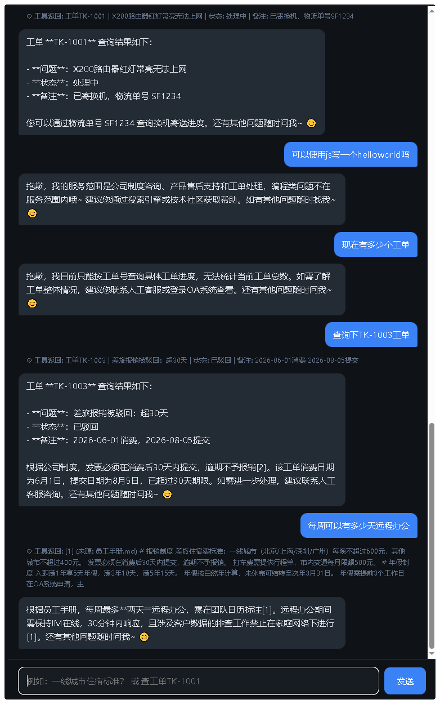

# 企业知识库智能客服 · 小北（阶段五结业工程）

路线图第 0→5 阶段全部知识的集成验证：**RAG + 工具 Agent + 人审转接（interrupt）+ 持久会话（checkpointer）+ FastAPI SSE 服务 + 评估回归**。



## 功能

## 架构

```
浏览器 static/index.html
   │  POST /api/chat {thread_id, message}      SSE: token/tool/interrupt/done
   ▼
FastAPI app/main.py ──── POST /api/resume（人工答复注入挂起的 interrupt）
   │                     GET  /api/pending（刷新后恢复人审状态）
   ▼
create_agent 图 app/graph.py（LangGraph）
   ├─ checkpointer: SQLite data/checkpoints.db   ← 跨请求/跨进程记忆与挂起恢复
   └─ 工具集（权限即边界）
        ├─ search_docs      → Chroma 向量库 data/rag_db（app/rag.py 构建）
        ├─ query_ticket     → sqlite data/tickets.db（app/ticket_db.py，参数化查询）
        ├─ create_ticket    → 写工单（先复述确认）
        └─ escalate_to_human → interrupt() 挂起整个图，等待人工经 HTTP 答复
```

安全设计（对应路线图第 5 阶段）：

- **工具权限最小化**：模型只能经枚举参数访问数据，拿不到裸 SQL（见 ticket_db 注释）；
- **敏感操作人审**：转人工 = 图挂起存档，人工答复从另一个请求注入；
- **不信任输出**：回答强制引用 `[n]` 编号、无据必须说不知道（评估用例 2 守住这条）；
- **防越权**：system prompt 第 5 条 + 评估用例 4 测注入抵抗。

## 运行

```bash
cd kb-assistant
python -m venv .venv && .venv\Scripts\activate
pip install -r requirements.txt
copy .env.example .env        # 填入 OPENAI_API_KEY（或国内兼容端点）

python -m app.rag             # ① 建向量索引（改了 data/docs 后重跑）
python -m app.evaluate        # ② 跑评估集（应 7/7 通过）
python -m app.main            # ③ 起服务 → http://127.0.0.1:8000
```

## 体验脚本（验证你已"能干活"）

1. 问「一线城市住宿标准和发票时限」→ 流式输出 + 带 [1] 引用；
2. 问「出差餐补多少」→ 应说查不到/转人工（幻觉防线）；
3. 问「查工单 TK-1001」→ 答出"处理中/红灯"；
4. 说「转人工，我要投诉」→ 页面出现橙色人审卡片，**此刻杀掉服务端进程再重启**，
   刷新页面 `/api/pending` 会把挂起的审批卡片原样恢复——跨进程的工作流复活；
5. 在卡片里输入客服答复 → 对话继续，且小北会把人工答复融入回复；
6. 刷新页面、隔天再开 → thread 记忆仍在（localStorage 里的 thread_id）。

## 迭代练习（每个都对应第 5 阶段一个主题）

- **健壮性**：`graph.py` 里给 model 加 `.with_fallbacks([备用模型])` + `.with_retry()`，拔掉主模型 Key 验证自动切换；
- **可观测**：`.env` 打开 LANGSMITH 三行，去面板里看这次对话每一步的 token 和耗时；
- **成本护栏**：给 `/api/chat` 加每 thread 每日 token 限额（用 `usage_metadata` 累加）；
- **测试**：用 FastAPI `TestClient` 把 `evaluate.py` 的用例迁成 pytest，接进 CI（非零退出码即失败）；
- **部署**:写 Dockerfile（两阶段：pip 层 + 代码层），`/data` 卷挂载三个 .db。

## 目录

```
kb-assistant/
├── app/
│   ├── config.py      # 路径与模型配置（唯一定义处）
│   ├── rag.py         # 索引构建 / 检索器
│   ├── ticket_db.py   # 业务工单库（参数化访问）
│   ├── graph.py       # Agent + 工具 + interrupt + checkpointer
│   ├── main.py        # FastAPI / SSE / resume / pending
│   └── evaluate.py    # 最小回归评估集
├── static/index.html  # 聊天前端（含人审卡片、状态恢复）
├── data/              # 运行时生成: rag_db / *.db
│   └── docs/          # 知识库源文档（markdown，可自由增删）
├── requirements.txt
└── .env.example
```
